# 🚀 Operagi — Local AI-Powered Document Assistant  
### Ask questions about your PDFs — powered by Qwen3:0.6b, running entirely on your machine ✨


> 🔒 **100% Private & Offline** — Your documents never leave your machine. No API keys. No cloud. No tracking.

---

## 📌 Overview

**Operagi** is a full-stack application that lets you:

✅ Upload PDF files  
✅ Automatically extract text and create semantic embeddings  
✅ Ask natural language questions about your documents  
✅ Get accurate, context-aware answers from a **local LLM** (`qwen3:0.6b`) via **Ollama**  
✅ All processing happens **on your own computer** — no data leaves your device

Built with:
- **Django** (Python backend)
- **Vue.js** (Modern frontend)
- **FAISS + Sentence Transformers** (for fast similarity search)
- **Ollama + qwen3:0.6b** (local, lightweight, Persian-friendly LLM)

Perfect for researchers, students, legal teams, or anyone who values **privacy + performance**.

---

## 💡 Key Features

| Feature | Description |
|--------|-------------|
| 📄 **PDF Upload & Processing** | Upload any PDF — text is extracted, chunked, and embedded automatically |
| 🔍 **Semantic Search (RAG)** | Uses `all-MiniLM-L6-v2` to find the most relevant document sections |
| 🤖 **Local LLM Answering** | Powered by `qwen3:0.6b` — runs on CPU, supports Persian, low memory usage |
| 🌐 **Multi-Language Support** | Ask in Persian, English, or other languages — response matches your input |
| 🧩 **Dynamic Response Profiles** | Choose between `quick`, `balanced`, `detailed`, or `creative` answer styles |
| 🛡️ **Zero Data Leakage** | Everything runs locally — no internet needed after setup |
| 🚀 **Fast & Lightweight** | Optimized for low-end machines — no GPU required |

---

## ⚙️ System Requirements

| Component | Minimum | Recommended |
|---------|--------|-------------|
| OS | Ubuntu 22.04+ / macOS / Windows 10+ | Any modern Linux/macOS/Windows |
| CPU | 4-core x86_64 | 8-core+ with AVX2 support |
| RAM | 8 GB | 16 GB (for larger contexts) |
| Storage | 20 GB free | 50 GB+ (for multiple models) |
| Internet | Only for initial model download | Not required after setup |

> ✅ **No GPU required!** Runs perfectly on CPU with `qwen3:0.6b`.

---

## 🚀 Quick Start (Install & Run)

### 1. Clone the Repository

```bash
git clone https://github.com/pydevcasts/Operagi.git
cd Operagi
```

### 2. Set Up Python Environment

```bash
python3 -m venv venv
source venv/bin/activate  # On Windows: venv\Scripts\activate
pip install -r requirements.txt
```

> ✅ Install dependencies: `django`, `langchain`, `sentence-transformers`, `faiss-cpu`, `PyPDF2`, `requests`

### 3. Install & Start Ollama

```bash
curl -fsSL https://ollama.com/install.sh | sh
ollama pull qwen3:0.6b
```

> 💡 This downloads the 600MB model — may take a few minutes.  
> Once done, it stays cached forever!

### 4. Run Django Backend

```bash
cd backend
python manage.py migrate
python manage.py runserver
```

> Backend runs at: `http://127.0.0.1:8000`

### 5. Run Vue.js Frontend

In a **new terminal**:

```bash
cd frontend
npm install
npm run dev
```

> Frontend runs at: `http://localhost:5173`

### 6. Open Your Browser

👉 Go to: [http://localhost:5173](http://localhost:5173)

🎉 You’re ready! Upload a PDF → Ask a question → Get an answer — all offline.

---

## 📁 Project Structure

```
Operagi/
├── backend/                 # Django REST API
│   ├── documents/           # Core app: upload, RAG, LLM
│   ├── settings.py
│   └── manage.py
├── frontend/                # Vue 3 + Vite
│   ├── src/
│   │   ├── components/      # PDF uploader, chat UI
│   │   └── App.vue
│   └── package.json
├── helper/                  # Utility functions
│   ├── embedding.py         # Text → Vector Embeddings
│   └── llm.py               # Ollama integration + dynamic profiles
├── requirements.txt
├── README.md
└── .gitignore
```

---

## 🧠 How It Works (RAG Pipeline)

```mermaid
graph LR
A[User Uploads PDF] --> B[Extract Text]
B --> C[Split into Chunks]
C --> D[Generate Embeddings with MiniLM]
D --> E[Store in FAISS Index]
E --> F[User Asks Question]
F --> G[Embed Question → Find Similar Chunks]
G --> H[Send Context + Question to qwen3:0.6b]
H --> I[LLM Generates Answer in Persian/English]
I --> J[Display Answer in UI]
```



All steps happen **locally** — no external APIs.

---

## 🎯 Advanced Usage

### ✅ Change Answer Style

In the frontend UI, select one of these profiles:

| Profile | Use Case |
|--------|----------|
| `quick` | Fast, short answers (e.g., “What’s KNN?”) |
| `balanced` | Default — good mix of detail and speed |
| `detailed` | Long, academic-style answers (e.g., “Explain transformer architecture”) |
| `creative` | Storytelling, brainstorming mode |

### ✅ Switch Language

Set `language` in the request to:  
`fa` (Persian), `en` (English), `es`, `fr`, etc.  
→ Model responds in the same language you asked in.

### ✅ Use Docker (Optional)

If you prefer containerization:

```bash
docker run -d -p 11434:11434 --name ollama ollama/ollama
docker exec ollama ollama pull qwen3:0.6b
```

Then start Django/Vue as usual — they’ll connect to `http://host.docker.internal:11434` (Linux/macOS) or `http://localhost:11434` (Windows).

---

## ❗ Troubleshooting

| Issue | Solution |
|-------|----------|
| `Error: Failed to connect to Ollama` | Run `ollama run qwen3:0.6b` manually first — let it load into memory |
| `CPU at 800%` | Use `qwen3:0.6b` — not heavier models like `llama3:8b`. Avoid `gemma3:latest` — poor Persian support. |
| `No response from model` | Check `nvidia-smi` — if GPU isn’t used, that’s fine. CPU is enough. |
| `Permission denied` on `/run/user/...` | Don’t use `sudo` with Docker/Ollama. Run everything as normal user. |
| `403 Forbidden` from `api.gapgpt.app` | We don’t use it anymore — remove all references to it. |

---

## 🔐 Privacy & Security

- ✅ **No data uploaded to cloud**
- ✅ **No API keys required**
- ✅ **All embeddings stored locally**
- ✅ **Model runs entirely on your machine**

Your documents are safe. Always.

---

## 🧪 Testing the API

Use `curl` to test the backend directly:

```bash
curl -X POST http://127.0.0.1:8000/api/ask/ \
  -H "Content-Type: application/json" \
  -d '{
    "document_id": 1,
    "question": "چطور کار می‌کنه؟",
    "profile": "detailed",
    "language": "fa"
  }'
```

You should get a JSON response with `"answer": "..."`.

---

## 📚 Supported Models

| Model | Size | Language | Notes |
|-------|------|----------|-------|
| `qwen3:0.6b` | ~500 MB | ✅ Persian, English | ✅ **Recommended** — fast, accurate, low resource |
| `phi3:mini` | ~1.4 GB | ✅ English | Good for English-only use |
| `gemma:2b` | ~1.4 GB | ✅ English | Better than `gemma3:latest` — avoid it |
| `llama3:8b` | ~4.5 GB | ✅ English | Too heavy for CPU — not recommended |

> ❌ Avoid `gemma3:latest`, `llama3.1:latest` — poor Persian support and high resource usage.

---

## 📈 Future Improvements

- [ ] Add voice input/output (Whisper + TTS)
- [ ] Export answers as PDF/Markdown
- [ ] Multi-user document sharing (with auth)
- [ ] Webhook notifications on new uploads
- [ ] Docker Compose deployment script

---

## 🤝 Contributing

Contributions are welcome!  
Please open an issue or PR with:

- Bug fixes
- New features
- Documentation improvements
- Translation enhancements (Persian/English)

---

## 📜 License

MIT © 2025 pydevcasts

---

## ❤️ Made with 💙 by pydevcasts

> A Data Scientist & Full-Stack Developer building private, powerful AI tools for everyone.

🔗 GitHub: [https://github.com/pydevcasts/Operagi](https://github.com/pydevcasts/Operagi)  
📧 Contact: pydevcasts@gmail.com

---
